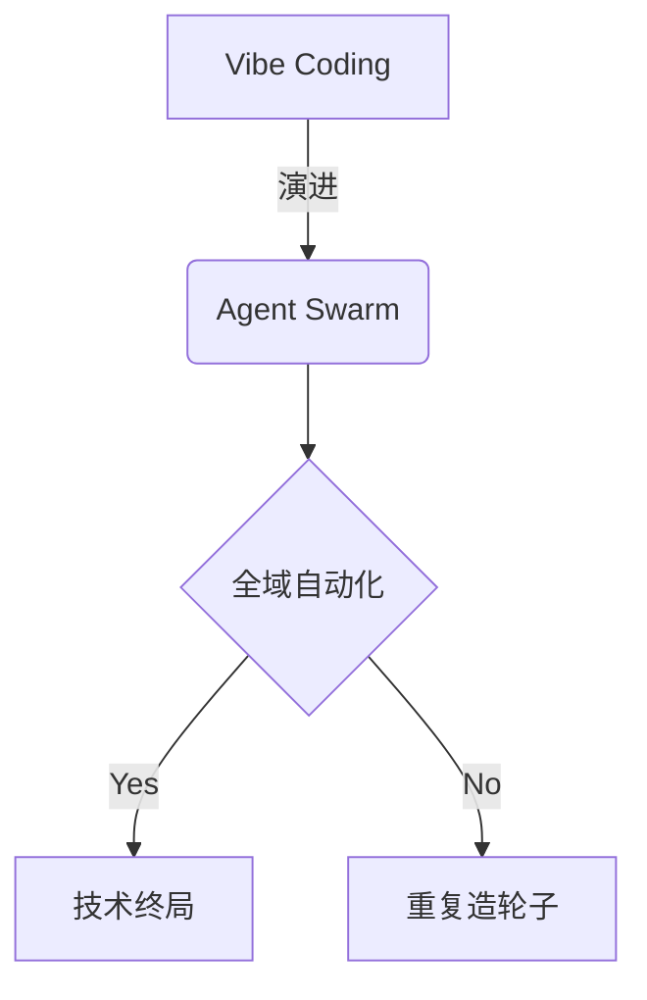

# 欢迎来到 AI 原生工程的世界

这是一本由极客发起、AI 深度参与编写的开源技术专著。
本页已调整为“目录与样式联调样本”，用于后续 TOC、标题层级、meta 信息样式的快速验证。

## 页面 Meta（用于样式联调）

### 当前 Frontmatter

- `title`: 前言
- `description`: AI 原生工程：Vibe Coding 进阶与全域自动化落地
- `icon`: BookOpen
- `full`: false

### 设计意图

#### 为什么保留 `full: false`

用于验证标准文档容器宽度下，TOC 与正文在复杂标题结构中的视觉稳定性。

#### 为什么新增 `icon`

用于验证侧边栏导航项中的图标占位、行高对齐以及深浅色切换对比度。

## 目录索引

- **[第一篇：破局](/docs/level-1)**：编程范式的第三次跨越
- **[第二篇：暗礁](/docs/level-2)**：真实场景的痛点与防线
- **[第三篇：实战](/docs/level-3)**：落地全栈 AI 工作流
- **[第四篇：越界](/docs/level-4)**：赋予 AI “手”与“眼”
- **[第五篇：终局](/docs/level-5)**：拥抱 Agent Swarm 与反脆弱设计

:::note
本书的内容正在持续构建中，部分章节可能会经历频繁的重构。欢迎通过 [GitHub](https://github.com/TatsukiMeng/ai-native-engineering) 参与共创！
:::

## 标题层级压测区（TOC 样式重点）

### 第一层：个人开发者阶段

#### IDE 级协作

##### Prompt 复用与上下文边界

围绕 Prompt 模板化、上下文窗口复位、任务拆分粒度，验证 `h2/h3/h4/h5` 的层级缩进与 active 高亮表现。

##### Debug 驱动式协作

验证“长标题 + 英文术语”场景：Copilot Agent + Terminal + MCP 的串联排版效果。

#### 数据与后端阶段

##### PostgreSQL 与迁移策略

关注数据库章节在目录中的可扫描性：标题密度高时是否仍能快速定位。

##### API 可靠性与熔断策略

关注告警色、链接色、代码内联色在深浅色主题下的一致性。

### 第二层：团队工程化阶段

#### 前端跨端与边界拆分

##### Web / Tauri / Wujie 复用策略

用于验证目录中“斜杠、短横线、括号”类标题文本的换行策略。

##### 组件协议与设计 Token

用于验证 TOC 宽度受限时的文本截断与 hover 展示效果。

#### 自动化流程与质量控制

##### CI 与静态导出约束

强调 `output: 'export'` 场景下的构建约束和产物一致性。

##### 回归验证与基线对比

强调“只改样式，不改语义”的迭代流程。

### 第三层：架构师与 Swarm 阶段

#### Agent Swarm 协作模型

##### 全域任务编排

关注章节目录在“概念层级深、跨度大”时的可读性。

##### Token 成本治理

关注“高频章节更新”下目录 active 状态跳转稳定性。

#### 风险与治理

##### 合规、审计与回溯

用于验证目录项较多时滚动条/遮罩（mask）观感。

##### 故障演练与降级路径

用于验证移动端折叠目录中的层级可点击面积。

## 🚀 集成的 MDX 高级特性

### 提示框组件（Callouts / Admonitions）

通过 `remark-directive` 与 `fumadocs-core/mdx-plugins` 支持，你可以在 Markdown 中直接使用 `:::` 语法。

**基础类型展示：**

:::note
这是一条普通的注意信息 (Note)。通常用于补充说明环境配置、版本要求等日常提醒。
:::

:::tip
这是一条建议提示 (Tip)。可以用来向读者推荐最佳实践、快捷键或者更优雅的实现方式。
:::

:::info
这是一条信息提示 (Info)。和 Note 类似，但侧重于提供一般性的背景知识。
:::

:::warning
这是一条警告信息 (Warning)。用于提醒读者某些操作存在风险，比如可能导致性能下降或者引发连带问题。
:::

:::danger
这是一条高危警告 (Danger)。用于极度危险的操作，例如不可逆的数据删除、导致系统崩溃的配置。
:::

### 自定义标题与内容嵌套

你可以在类型名称后面直接跟随自定义文本作为标题，内部甚至还可以包裹代码块或列表：

:::warning[这是一个包含自定义标题的警告]
如果在进行大重构之前没有提交当前 `git commit`，你可能会**丢失所有代码**。以下是建议的工作流：
1. 检查 `git status`
2. 运行所有的单元测试
```bash
bun run test
```
:::

:::tip[高级用法：嵌套提示框]
在写作中，有时候我们需要在提示框中进一步强化某个痛点：
> 别忘了，AI 生成的代码偶尔也会存在上下文遗忘的情况。
:::

### Mermaid 图表渲染

我们通过 `remarkMdxMermaid` 实现了原生 Mermaid 语法的构建期预编译支持，你可以直接书写标准的 Mermaid 代码块。



## 🧪 Markdown 语法回归测试区

这一节用于做视觉与渲染回归，目标是覆盖常见语法：段落、强调、列表、引用、表格、代码、媒体、嵌套提示框等。

### 文本与链接

这是普通段落，包含 **加粗**、*斜体*、~~删除线~~、`inline code`、以及 [站内链接](/docs/level-1/mindset-shift) 与 [外部链接](https://nextjs.org/)。

### 列表与任务

- 一级无序项 A
    - 二级无序项 A-1（测试缩进与 marker）
    - 二级无序项 A-2（含 `inline code`）
- 一级无序项 B

1. 一级有序项 1
2. 一级有序项 2
     1. 二级有序项 2-1
     2. 二级有序项 2-2

- [x] 已完成任务（Task List）
- [ ] 待完成任务（Task List）

### 引用与分隔线

> 这是一级引用。
>
> > 这是二级引用，用于测试嵌套引用在深浅色下的层级与导示条。

---

### 表格

| 维度 | 目标 | 状态 |
| :--- | :---: | ---: |
| 样式对齐 | Fuwari 视觉 1:1 | 进行中 |
| 行为一致 | TOC / 滚动激活 | 已完成 |
| 构建质量 | typecheck + build | 已完成 |

### 代码块

```ts
type Stage = "vibe" | "swarm";

export function plan(stage: Stage) {
    return stage === "vibe" ? "single-agent" : "agent-cluster";
}
```

```bash
bun run types:check
bun run build
```

```json
{
    "name": "ai-native-engineering",
    "mode": "static-export",
    "runtime": "bun"
}
```

```diff
- TODO: 临时样式
+ DONE: 迁移到 Fuwari token
```

### 媒体与内嵌


<iframe
    src="https://www.youtube.com/embed/dQw4w9WgXcQ"
    title="iframe 测试"
    width="560"
    height="315"
    loading="lazy"
    referrerPolicy="no-referrer"
    allow="accelerometer; autoplay; clipboard-write; encrypted-media; gyroscope; picture-in-picture; web-share"
    allowFullScreen
/>

### 细节折叠（HTML in MDX）

<details>
    <summary>点击展开更多测试内容</summary>

    这是折叠区域内容，用于验证 `details/summary` 的排版、边距与可点击反馈。

    - 折叠项 A
    - 折叠项 B
</details>

### Callout 深度测试（::: 语法）

:::note
Note：用于常规说明。
:::

:::tip
Tip：用于最佳实践提示。
:::

:::warning
Warning：用于风险提醒。
:::

:::danger
Danger：用于高危操作提醒。
:::

:::note[自定义标题 + 嵌套内容]
这是一个带自定义标题的 note。

:::warning
这是嵌套在 note 内的 warning，用于测试内层层级。
:::
:::

:::tip[列表 + 代码 + 引用混排]
1. 先检查 `git status`
2. 再运行 `bun run build`

```bash
bun run types:check && bun run build
```

> 混排内容用于验证 Callout 容器内部间距一致性。
:::

:::note[多层嵌套测试：Level 1 Note]
这一层用于观察最外层容器的标题、before 导示条和正文间距。

:::warning[Level 2 Warning]
这一层用于观察在 Note 内部嵌套 Warning 时，子级 before 是否为 warning 色。

:::tip[Level 3 Tip]
这一层用于观察第三层嵌套时的缩进、导示条、标题图标与文本对齐。

- 子项 A：验证列表缩进
- 子项 B：验证 marker 与正文基线

> 三级嵌套引用：验证混排时的层级可读性。
:::
:::
:::

:::warning[复杂 Markdown 压测]
下面这一段用于测试在 Callout 内部混排复杂 Markdown 时的稳定性。

1. 第一阶段：准备
     - [x] 检查 `bun --version`
     - [ ] 检查 `bun run types:check`
2. 第二阶段：执行
     - 运行增量验证
     - 记录渲染差异

| 维度 | 目标 | 说明 |
| :--- | :---: | ---: |
| title 色彩 | 按层级独立 | 不被父级污染 |
| before 导示条 | 按类型独立 | 与 bdm-* 对齐 |
| 内容排版 | 无异常折行 | 列表/表格/代码共存 |

```ts
type VerifyItem = {
    id: string;
    passed: boolean;
};

const checks: VerifyItem[] = [
    { id: "nested-title-color", passed: true },
    { id: "nested-before-color", passed: true },
];
```

> 引用块验证：当内容包含 [外链](https://nextjs.org/) 与 `inline code` 时，行高与颜色应保持一致。
:::


### Git 元信息注入

通过 `lastModified()` 插件，我们在页面底部（评论区上方）实现了基于最近一条 Git 提交记录生成的页面「最后更新时间」。当你修改本页面并推送到主分支，时间会自动更新。

### Giscus 评论系统

我们引入了 `@giscus/react` 并支持了自动适配当前系统的亮、暗色模式，它会自动抓取当前路由页面名称并关联到 GitHub Discussions 对应的主题下。
